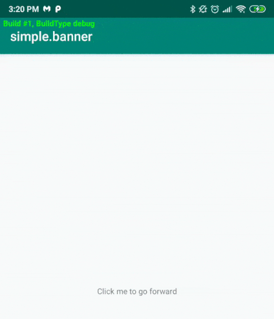

[](https://android-arsenal.com/api?level=14)
# Simple Banner
A simple library to display a simple banner within your app




### Usage

Inside your `Application` Class

```
   SimpleBanner.init(this)
```
Then use the below method to update the content
```
   SimpleBanner.updateContent(Color.BLUE, "Build #${BuildConfig.VERSION_CODE}, BuildType ${BuildConfig.BUILD_TYPE}")
```

Or you can predefine the content 
```
   SimpleBanner.init(this, Color.GREEN, "Build #${BuildConfig.VERSION_CODE}, BuildType ${BuildConfig.BUILD_TYPE}")
```

Either method above can be used but updateContent will allow you to update content after the library is initialized

### Download

Add the following to your `build.gradle` file

```groovy
dependencies {
    debugImplementation "com.offbow.simplebanner:core:0.1.0"
    releaseImplementation "com.offbow.simplebanner:no-op:0.1.0"
}
```

### License

```
Copyright 2019 Harry Bartlam

Licensed under the Apache License, Version 2.0 (the "License");
you may not use this file except in compliance with the License.
You may obtain a copy of the License at

   http://www.apache.org/licenses/LICENSE-2.0

Unless required by applicable law or agreed to in writing, software
distributed under the License is distributed on an "AS IS" BASIS,
WITHOUT WARRANTIES OR CONDITIONS OF ANY KIND, either express or implied.
See the License for the specific language governing permissions and
limitations under the License.
```


